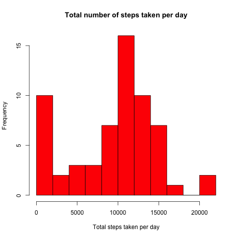
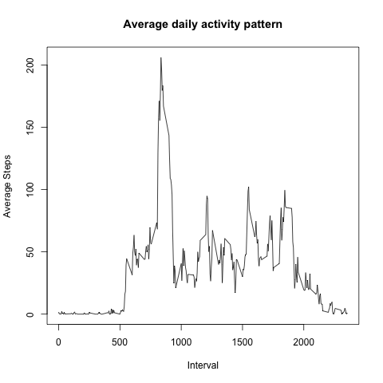
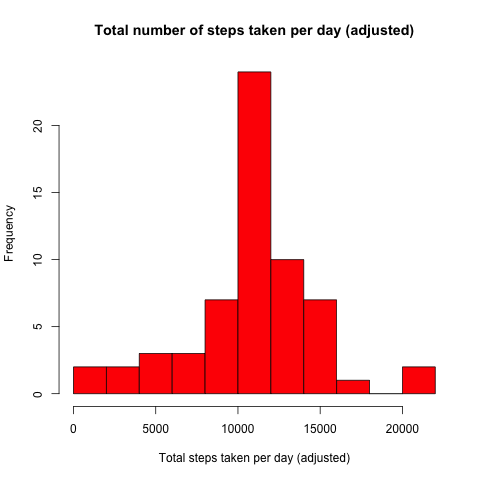
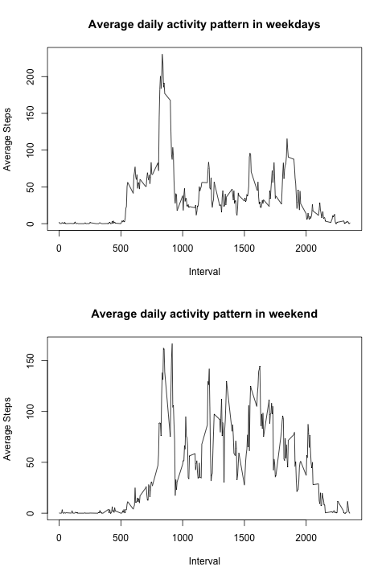

##Introduction

It is now possible to collect a large amount of data about personal movement using activity monitoring devices such as a Fitbit, Nike Fuelband, or Jawbone Up. These type of devices are part of the “quantified self” movement – a group of enthusiasts who take measurements about themselves regularly to improve their health, to find patterns in their behavior, or because they are tech geeks. But these data remain under-utilized both because the raw data are hard to obtain and there is a lack of statistical methods and software for processing and interpreting the data.

This assignment makes use of data from a personal activity monitoring device. This device collects data at 5 minute intervals through out the day. The data consists of two months of data from an anonymous individual collected during the months of October and November, 2012 and include the number of steps taken in 5 minute intervals each day.

##Data

The data for this assignment can be downloaded from the course web site:

- Dataset: Activity monitoring data [52K]

The variables included in this dataset are:

- steps: Number of steps taking in a 5-minute interval (missing values are coded as NA)

- date: The date on which the measurement was taken in YYYY-MM-DD format

- interval: Identifier for the 5-minute interval in which measurement was taken

The dataset is stored in a comma-separated-value (CSV) file and there are a total of 17,568 observations in this dataset.

##Loading and preprocessing the data

Load the dataset into variable activity and convert the date column to date class:
```{r}
activity <- read.csv("activity.csv", stringsAsFactors=F)
activity$date <- as.Date(activity$date)
str(activity)
```

##Analysis
###What is mean total number of steps taken per day?

Using tapply to caculate total steps taken per day.
```{r}
dailysteps <- tapply(activity$steps, activity$date, sum, na.rm=T)
hist(dailysteps, main="Total number of steps taken per day", xlab="Total steps taken per day", col="red", breaks=15)
```


Calulate the mean and median of the toal number of steps taken per day
```{r}
mean(dailysteps, na.rm=T)
median(dailysteps, na.rm=T)
```

###What is the average daily activity pattern?

Using tapply to caculate average steps taken per interval.
```{r}
avesteps <- tapply(activity$steps, activity$interval, mean, na.rm=T)
plot(names(avesteps), avesteps, main="Average daily activity pattern", xlab="Interval", ylab="Average Steps", type="l")
```


Using which.max to look for the interval contains the maximum number of steps
```{r}
avesteps[which.max(avesteps)]
```

Interval 835 contains the max number of steps 206.1698.

###Imputing missing values

In the original dataset 2304 rows are filled with NA.
```{r}
sum(!complete.cases(activity))
```

To make the data set better for analyzing, replace NAs by the mean steps on the date.
```{r}

#store all rows without na to datawoNA
#data <- activity
datawoNA <- activity[complete.cases(activity),]

#store all rows with na into var dataNA
dataNA <- activity[is.na(activity),]

#use the average steps by interval from last step, convert it to proper format and give proper colnames to it
average <- as.data.frame(as.table(avesteps))
colnames(average) <- c("interval", "steps mean")
average$interval <- as.integer(as.character(average$interval))

#merge dailyave and dataNA by date, then use steps mean value from dailyave instead of nas from dataNA and rename the columns
mergdat <- merge(average, dataNA, by="interval", all=T)[c(1,2,4)]
mergdat <- mergdat[c(2,3,1)]
colnames(mergdat)[1] <- "steps"
```

Create a new variable to store this adjusted data set.
```{r}
newactivity <- rbind(mergdat, datawoNA)
newactivity <- newactivity[order(newactivity$date),]
str(newactivity)
sum(is.na(newactivity))
head(newactivity)
```

Make a histogram of the total number of steps taken each day
```{r}
newdailysteps <- tapply(newactivity$steps, newactivity$date, sum)
hist(newdailysteps, main="Total number of steps taken per day (adjusted)", xlab="Total steps taken per day (adjusted)", col="red", breaks=15)
```


Caculate the mean and median 
```{r}
mean(newdailysteps)
median(newdailysteps)
```

###Are there differences in activity patterns between weekdays and weekends?

Add a new coloum providing the weekday information to the new data set.
Subset weekdays and weekend, and make two plots to show the differnces between weekdays and weekend.
```{r}
newactivity$weekday <- ifelse(weekdays(newactivity$date)%in%c("Saturday","Sunday"), "Weekend", "Weekdays")
weekdayactivity <- subset(newactivity, weekday %in% "Weekdays")
weekendactivity <- subset(newactivity, weekday %in% "Weekend")

wkdayavesteps <- tapply(weekdayactivity$steps, weekdayactivity$interval, mean, na.rm=T)
wddayavesteps <- tapply(weekendactivity$steps, weekendactivity$interval, mean, na.rm=T)

par(mfrow=c(2,1))
plot(names(wkdayavesteps), wkdayavesteps, main="Average daily activity pattern in weekdays", xlab="Interval", ylab="Average Steps", type="l")
plot(names(wddayavesteps), wddayavesteps, main="Average daily activity pattern in weekend", xlab="Interval", ylab="Average Steps", type="l")
```


